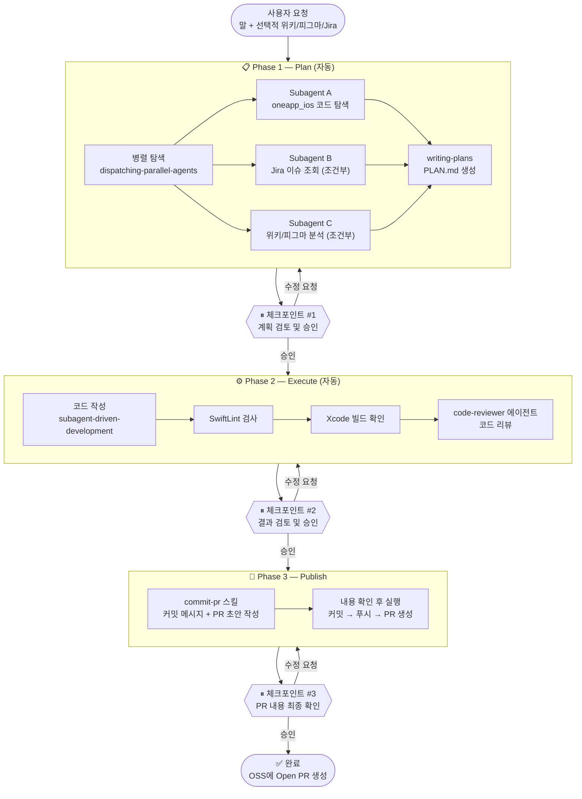

# `/dev` 워크플로우 설계

> 작성일: 2026-03-25
> 목적: Plan → Execute → Publish 3단계 자동화 워크플로우 (iOS 개발용)

---

## 전체 흐름도



---

## 사용 방법

```bash
# 말로 요청
/dev "로그인 버튼 색상 바꿔줘"

# Jira 이슈
/dev "WMONE-1234"

# 스펙 첨부
/dev "위키 URL + 피그마 스크린샷"

# 조합
/dev "WMONE-1234 + 위키 URL + 피그마 이미지"
```

---

## 단계별 상세

### Phase 1 — Plan

| 항목 | 내용 |
|------|------|
| 사용 스킬 | `dispatching-parallel-agents`, `writing-plans` |
| 병렬 탐색 | oneapp_ios 코드 / Jira 이슈 / 위키·피그마 (있는 것만) |
| 산출물 | `PLAN.md` |
| 체크포인트 | 계획 검토 후 승인 또는 수정 요청 |

### Phase 2 — Execute

| 항목 | 내용 |
|------|------|
| 사용 스킬 | `subagent-driven-development` |
| 자동 수행 | 코드 작성 → SwiftLint → Xcode 빌드 → 코드 리뷰 |
| 실패 시 | 자동 수정 시도 (최대 3회) → 안 되면 사용자에게 보고 |
| 체크포인트 | 결과 검토 후 승인 또는 수정 요청 |

### Phase 3 — Publish

| 항목 | 내용 |
|------|------|
| 사용 스킬 | `commit-pr` |
| 자동 수행 | Jira 정보로 PR 제목/라벨/마일스톤 채우기, 초안 작성 |
| 체크포인트 | 커밋 메시지 + PR 내용 확인 후 실행 |

---

## 활용하는 기존 스킬/슈퍼파워

```
dispatching-parallel-agents  → Plan 병렬 탐색
writing-plans                → PLAN.md 생성
subagent-driven-development  → 코드 구현
superpowers:code-reviewer    → 코드 리뷰 에이전트
commit-pr                    → 커밋 + PR 생성
```

---

## 다음 단계

- [ ] `dev` 스킬 파일 작성 (`~/.claude/skills/dev/SKILL.md`)
- [ ] 실제 작업에 테스트 적용
- [ ] 필요에 따라 단계 조정
